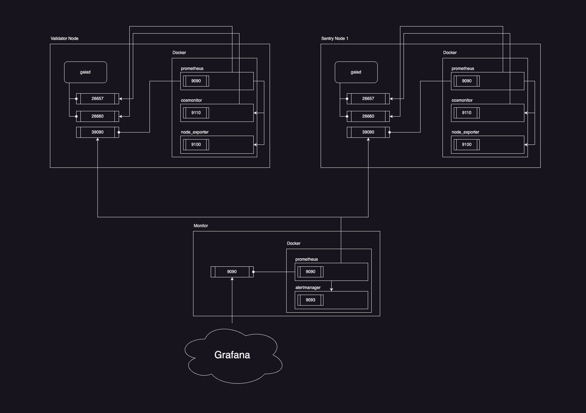

# Cosmonitor
Cosmonitor is a comprehensive monitoring infrastructure for Cosmos-SDK nodes and validators, offering alerting capabilities and a Grafana dashboard for a scalable and robust monitoring experience.

## Requirements

* 1 or more nodes/validators: The Cosmos-SDK nodes or validators that you want to monitor
* 1 dedicated monitoring vps: A dedicated monitoring Virtual Private Server (VPS) meeting these minimum requirements:
    * CPU: 1 core
    * RAM: 1 GB
    * HDD/SSD: 20 GB
    * Ubuntu 22 (suggested)

## Architecture



## Monitor

The monitor server monitors all the targeted nodes/validators Prometheus servers, sending alerting notifications directly to the chosen provider (ex. Telegram, email, etc.) in case of issues.

### Setup

1. Install Docker:

```
curl -fsSL https://get.docker.com -o get-docker.sh && sudo sh get-docker.sh && rm get-docker.sh
```

2. Get the repo and navigate inside the `monitor` folder.
3. Create and configure `./prometheus/target.json` according to the `target.sample.json`.
4. Create and configure `./alertmanager/alertmanager.yml` according to the `alertmanager.sample.yml`. In order to add additional alerting providers, refer to [this guide](https://prometheus.io/docs/alerting/latest/configuration/#receiver-integration-settings) .
5. Enable the firewall:

```
 sudo ufw allow ssh
 sudo ufw allow 9090/tcp
 sudo ufw enable
```

1. Start the monitor with `./start.sh` to initiate monitoring.

## Node/Validator

### Setup

1. Install Docker:

```
curl -fsSL https://get.docker.com -o get-docker.sh && sudo sh get-docker.sh && rm get-docker.sh
```

2. Get the repo and navigate inside the `node` folder.
3. Add the following rules to the firewall:

```
 sudo ufw allow from 172.16.0.0/12 to any port 26657 proto tcp # docker internal usage
 sudo ufw allow from 172.16.0.0/12 to any port 26660 proto tcp # docker internal usage
 sudo ufw allow from <MONITOR_IP> to any port 39090 proto tcp # expose prometheus 
 sudo ufw reload
```

4. Edit the `$HOME/.<CHAIN_FOLDER>/config/config.toml` and set:

```
[rpc] section
laddr = "tcp://0.0.0.0:26657" # [rpc] section

[instrumentation] section
prometheus = true
prometheus_listen_addr = ":26660"
namespace = "cometbft"
```

5. Restart the chain service with `sudo systemctl restart <CHAIN_SERVICE_NAME>`.
6. Start the server with `./start.sh`.

## Multi Node/Validator on 1 Server
In order to run the node monitoring setup on a server with multiple instances of nodes/validators follow this example with 2 nodes (3 or more are ): 
1. Follow the first two steps (1. & 2.) of the `Node/Validator Setup`.
2. Add the following firewall rules, repeating them for each node instance running:

```
 Node 0
 sudo ufw allow from 172.16.0.0/12 to any port 26657 proto tcp # docker internal usage
 sudo ufw allow from 172.16.0.0/12 to any port 26660 proto tcp # docker internal usage
 sudo ufw allow from <MONITOR_IP> to any port 39090 proto tcp # expose prometheus
 
 Node 1
 sudo ufw allow from 172.16.0.0/12 to any port 36657 proto tcp # docker internal usage
 sudo ufw allow from 172.16.0.0/12 to any port 36660 proto tcp # docker internal usage
 sudo ufw allow from <MONITOR_IP> to any port 39091 proto tcp # expose prometheus 
 
 Node 2
 sudo ufw allow from 172.16.0.0/12 to any port 46657 proto tcp # docker internal usage
 sudo ufw allow from 172.16.0.0/12 to any port 46660 proto tcp # docker internal usage
 sudo ufw allow from <MONITOR_IP> to any port 39092 proto tcp # expose prometheus 
 
 Node 3
 ...
 
 sudo ufw reload
```
3. Repeat `Node Setup step 4.` for each node instance, configuring each node/validator port and ensuring that the firewall rules are applied as specified above.
4. Inside `prometheus/multi`, create and edit the configuration files accordingly to the number of nodes/validators.
5. Edit the `compose-multi.yml` file according to the number of nodes/validators and their respective configurations.
6. Start the server with `./multistart.sh`.